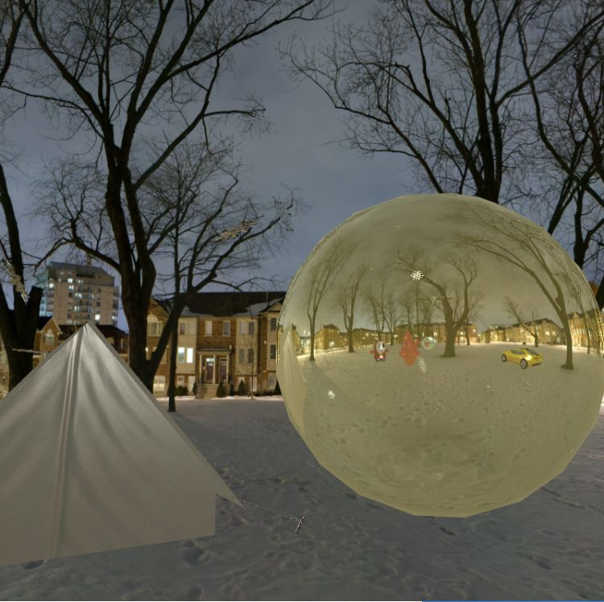

# Webgl-dynamic-scene

分為兩種視角，第一人稱視角為鬼的視角，而第三視角為嘿呵(紅衣角色)的視角，可以自由切換。
場景中的雪花以refraction去設計且每個狀態為隨機生成的(場景一次有50個雪花)，x、y、z position隨機取數。
其中，黃色大球體為dynamic reflection，可以將場景的物件和cube map 反射出來。
帳篷的紋路，和炭火的石頭皆為有使用bumping 產生材質。

+ player motivation

  ​		player為鬼可以往前往後，也可以旋轉視角。

+ First perspective v.s. Third perspective

  + 第三視角

  

  

+ Camera 

  + 此塊長方體呈現如攝影機的效果，將另一個camer view render在此長方體上，會隨著人物移動畫面中的人也會移動。

  

+ Cube scene

  ​	player移動不會超出cube外，但player和其他物件的相對位置會更改

+ 材質 ( Texture )

  ​	帳篷的紋路，和炭火的石頭皆使用bumping 產生材質。

+ 折射( Refraction )

  ​	途中的雪花為refraction設計，隨機生成和選轉

+ 全反射( Total Reflection  )

  

  

### 執行方式

在Chrome上執行請先利用Python建立Web服務

1. 在終端機前往此專案目錄下執行:

   ```
   $ python3 -m http.server
   ```

   

2. 前往 Chrome 在網址欄輸入

   ```
   localhost:8000
   ```

   


#### 鍵盤操作:

w: 往前

s: 往後

a: 切換視角

第一視角旋轉控制: 滑鼠拖移
